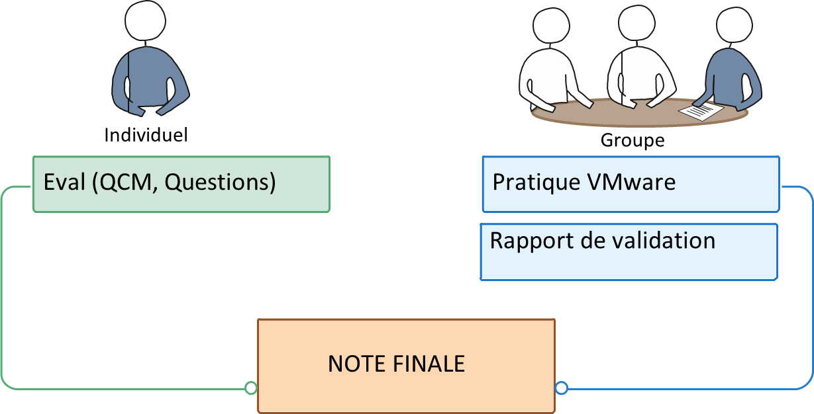

# Module C-190 - Mettre en place et exploiter une plateforme de virtualisation

🔗 https://etml-inf.github.io/C-190-Virtualisation/

## Introduction

Le module **C-190 - Virtualisation des Serveurs** a pour objectif d'enseigner aux étudiants la mise en place d’un environnement virtuel. À l’issue de ce module, les élèves seront capables de :
- Décrire les principales techniques de virtualisation.
- Installer et configurer des serveurs virtuels VMware.
- Comprendre les implications métiers de la virtualisation.

Ce module se compose **d'une partie théorique** et **d'un projet pratique** réalisé en groupe.

> ℹ️ En plus de cela, ce module est également accompagné du P_SYS-190, un projet pratique sur HyperV qui se déroulera seul ou en groupe de 2. Ce projet est disponible dans la marketplace ETML. 

# Organisation du module

Le module se déroulera sur **8 à 9 semaines**, avec une alternance entre théorie et pratique. 

| Semaine | Contenu | Liens théorie et exercices |
|---------|---------|---------|
| 1 | Identification du module et explications GitHub   Introduction   Théorie sur la virtualisation S01    E01   Théorie sur VMware S02   Présentations par groupe   E02 |[🔗S01 - WEB](https://etml-inf.github.io/C-190-Virtualisation/S01-C190-Introduction.html)  [🔗E01 - PDF](https://etml-inf.github.io/C-190-Virtualisation/exercices/E01-C190-Introduction.pdf)   [🔗S02 - WEB](https://etml-inf.github.io/C-190-Virtualisation/S02-C190-Introduction-VmWare.html)   [🔗E02 - PDF](https://etml-inf.github.io/C-190-Virtualisation/exercices/E02-C190-Introduction-a-VmWare.pdf) |
| 2 | Explication Infra ETML et prestataire   E03-Th + E03-Pra (Installation ESXi Physique & Nested)   **Rapport de validation E03**  |❌|
| 3 | E04-Th + E04-Pra (Installation vCenter)   E05-Th + E05-Pra   **Rapport de validation E04**    **Rapport de validation E05**   ⚠️ **EVAL 01** |❌|
| 4 | E06 + E06-EtudeCout   E07-Th + E07-Pra   **Rapport de validation E07** |❌|
| 🏖️ |  |🏖️|
| 5 | E08-Pra   ⚠️ **EVAL 02**   |❌|
| 6-8 | Projet P_SYS-190 sur HyperV |❌|
| 9 | **Rendu du projet P_SYS-190**   Remettre network LABO en état   Supprimer VMs chez prestataire. |❌|
> ℹ️ ~~Ce planning peut être amené à changer.~~ Ce planning va très probablement bouger un peu. 

# Contenu du module
La théorie ainsi que les exercices se trouvent ici :

🔗 https://etml-inf.github.io/C-190-Virtualisation/

## 1. Intro-Théorie (10p)

- **Introduction**
- **Historique**
- **Définition**
- **Intérêts**
- **Virtualisation de Plateformes**
  - Hyperviseur type 1
  - Hyperviseur type 2
- **Virtualisation par conteneur**
- **Cloud computing**
- **Virtualisation de Réseaux**
- **Virtualisation de Stockage**

## 2. VMWare (30p)

### Semaine 2 : Introduction VMWare
- **Historique**
- **Produits VMWare**
  - ESXi
  - VCenter
  - VSphere
  - VMTools
- **Concept**
- **Fonctionnalités**
- **Installation ESXi**
  - Méthodes d'administration
  - Serveur ESXi
  - Client VSphere

### Semaine 3 : Installation et Configuration
- **Installation VCenter**
  - Fonctionnalités
  - Utilité de VmTools
- **Configuration VCenter**
  - HA et DSR

### Semaine 4 : Gestion des Infrastructures
- **Impacts**
- **Coûts**
- **Licences**
- **Sauvegarde**
- **Outils de conversion**
  - P2V
  - V2P
  - V2V
- Ressource Pool
- Machines Virtuelles
  - Création modèle
  - Importation
  - Clonage
  - Snapshot

### Semaine 5 : Gestion des Machines Virtuelles
- Gestion des VM
  - Snapshot
  - Migration à chaud
- Gestion des vSphere
  - Monitoring
  - Alarmes
  - Planification des tâches

## 3. Projet P_SYS-190 - HyperV
Le projet se déroulera sur 3 à 4 semaines. Les semaines 6-7 à 9.
C'est un projet pratique sur HyperV qui se déroulera seul ou en groupe de 2.

Le projet est disponible sur la marketplace. "*Mise en place d’une infrastructure virtualisée avec Windows Server Hyper-V*" 

# Évaluation du Module

L'évaluation du module est composée de deux parties :

1. **Théorie (60%)**  
   **Deux tests** seront effectués en semaine 3 et 5 pour évaluer la progression des élèves. Les tests peuvent inclure des QCM ou des questions ouvertes selon le sujet.

2. **Pratique VMware (40%)**  
Par groupe de 2, le projet consiste à l'installation, configuration, gestion et validation d’un environnement virtualisé VMware. Les critères d’évaluation seront basés **sur l’avancement du projet, l’exactitude de la mise en place, validés par des rapports.** La note de cette partie, comprenant 4 rapports de validation sera
la même pour le groupe. Une pénalité, allant jusqu’à 1 point sur la note de pratique pourra sanctionner un mauvais comportement, ou le manque de collaboration d’un membre du groupe.

**Le rapport de validation** est un document fournit par votre enseignant, dans lequel vous insérerez des copies d’écran, transcrirez des commandes et où vous répondrez à des questions.
Ce document vous sera remis au début de chaque exercice, et sera rendu à la fin de celui-ci. Il devra être le plus précis possible, pour bien montrer les paramètres, les configurations correspondent bien à ce qui est attendu.

# Conclusion

Le module C-190 permet aux étudiants d'acquérir des compétences essentielles en virtualisation et en gestion de plateformes virtualisées. La combinaison de théorie, pratique et projet final assure une compréhension approfondie et une application concrète des concepts abordés.
