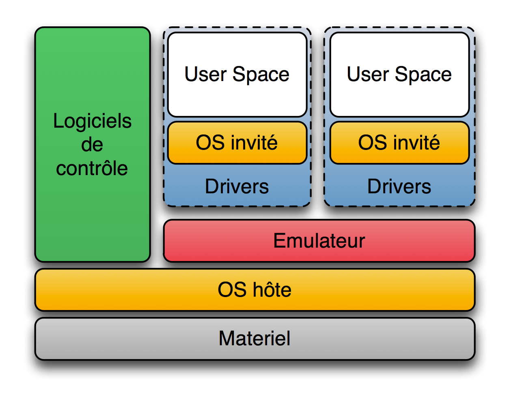

<!-- header: "C-190 - La virtualisation" -->
# C-190 - La virtualisation

---

## A votre avis, c'est quoi ? 

---

# Plan du cours
 - Introduction
 - Historique
 - Définition
 - Intérêts
 - Virtualisation de serveurs / machines
 - Virtualisation par conteneur
 - Cloud Computing
 - Virtualisation de Réseaux
 - Virtualisation de Stockage

---
<!-- header: "C-190 - La virtualisation > Introduction" -->
## Introduction

La virtualisation est une technologie qui permet de créer des versions virtuelles de ressources informatiques telles que des serveurs, des systèmes de stockage et des réseaux. Elle permet de maximiser l'utilisation des ressources physiques et de réduire les coûts.

---
<!-- header: "C-190 - La virtualisation > Introduction" -->
### Types de virtualisation
- **Virtualisation de serveur** : Permet de faire fonctionner plusieurs systèmes d'exploitation sur un seul serveur physique.
- **Virtualisation de stockage** : Combine plusieurs dispositifs de stockage physique en un seul pool de stockage logique.
- **Virtualisation de réseau** : Crée des réseaux virtuels indépendants du matériel réseau physique.
- **Virtualisation d'application** : Permet aux applications de fonctionner dans des environnements isolés.

---
<!-- header: "C-190 - La virtualisation > Introduction" -->
### Avantages supplémentaires
- **Facilité de gestion** : Simplifie la gestion des ressources informatiques.
- **Récupération après sinistre** : Facilite la reprise après sinistre grâce à des sauvegardes et des restaurations plus rapides.
- **Déploiement rapide** : Permet de déployer rapidement de nouvelles applications et services.

---
<!-- header: "C-190 - La virtualisation > Introduction" -->
### Cas d'utilisation
- **Consolidation de serveurs** : Réduire le nombre de serveurs physiques en exécutant plusieurs machines virtuelles sur un seul serveur.
- **Environnements de test et de développement** : Créer des environnements de test et de développement isolés sans besoin de matériel supplémentaire.
- **Cloud computing** : Fournir des services informatiques à la demande via Internet.

---

<!-- header: "C-190 - La virtualisation > Historique" -->
## Historique

- **Années 1960** : IBM développe les premiers systèmes de virtualisation pour ses mainframes.
- **Années 1990** : La virtualisation devient populaire avec l'avènement des serveurs x86.
- **Années 2000** : VMware introduit des solutions de virtualisation pour les entreprises.
- **Aujourd'hui** : La virtualisation est omniprésente dans les centres de données et les environnements cloud.

---

<!-- header: "C-190 - La virtualisation > Définition" -->
## Définition

La virtualisation consiste à créer une version virtuelle (plutôt que réelle/physique) de quelque chose, comme un système d'exploitation, un serveur, un dispositif de stockage ou des ressources réseau.

---

<!-- header: "C-190 - La virtualisation > Intérêts" -->
## Intérêts

- **Optimisation des ressources** : Utilisation plus efficace des ressources matérielles.
- **Réduction des coûts** : Moins de matériel nécessaire, économies d'énergie.
- **Flexibilité et scalabilité** : Facilité de déploiement et de gestion des ressources.
- **Isolation et sécurité** : Environnements isolés pour les applications et les services.

---

<!-- header: "C-190 - La virtualisation > Virtualisation de serveurs / machines" -->
## Virtualisation de serveurs / machines

### Hyperviseur type 1

- **Définition** : Hyperviseur s'exécutant directement sur le matériel physique.
- **Exemples** : VMware ESXi, Microsoft Hyper-V, Xen, Proxmox, Acropolis (nutanix).

---

---

<!-- header: "C-190 - La virtualisation > Virtualisation de serveurs / machines" -->
### Hyperviseur type 2

- **Définition** : Hyperviseur s'exécutant au-dessus d'un système d'exploitation hôte.
- **Exemples** : VMware Workstation, Oracle VirtualBox, Parallels Desktop.

---

---

<!-- header: "C-190 - La virtualisation > Virtualisation par conteneur" -->
## Virtualisation par conteneur

- **Définition** : Méthode de virtualisation au niveau du système d'exploitation permettant d'exécuter plusieurs applications isolées dans des conteneurs en réutilisant le même noyau (kernel) du système hôte.
- **Avantages** : Légèreté, rapidité de déploiement, portabilité.
- **Exemples** : Docker, Kubernetes, LXC.

---

---

<!-- header: "C-190 - La virtualisation > Cloud Computing" -->
## Cloud Computing

- **Définition** : Fourniture de services informatiques (serveurs, stockage, bases de données, réseaux, logiciels) sur Internet ("le cloud").
- **Modèles de service** : IaaS (Infrastructure as a Service), PaaS (Platform as a Service), SaaS (Software as a Service).
- **Exemples** : Amazon Web Services (AWS), Microsoft Azure, Google Cloud Platform (GCP).

---

<!-- header: "C-190 - La virtualisation > Virtualisation de Réseaux" -->
## Virtualisation de Réseaux

- **Définition** : Création de réseaux virtuels qui fonctionnent indépendamment du matériel réseau physique.
- **Avantages** : Flexibilité, gestion simplifiée, isolation des réseaux.
- **Exemples** : VMware NSX, Cisco ACI, OpenStack Neutron.

---

<!-- header: "C-190 - La virtualisation > Virtualisation de Stockage" -->
## Virtualisation de Stockage

- **Définition** : Abstraction des ressources de stockage physique pour les présenter comme un pool de stockage unique et logique.
- **Avantages** : Gestion simplifiée, meilleure utilisation des ressources, flexibilité.
- **Exemples** : VMware vSAN, Microsoft Storage Spaces, NetApp ONTAP.

---

# Exercice
Effectuez l'exercice E01. 

---
<!-- header: "C190 - La virtualisation > Sources" -->
# Sources
## Web
- https://fr.wikipedia.org/wiki/Virtualisation

## Images 
- https://fr.wikipedia.org/wiki/Virtualisation
- https://commons.wikimedia.org/wiki/File:Docker-containerized-and-vm-transparent-bg.png

