<!-- header: "C-190 - VMWare" -->
# C-190 - VMWare

---

## A votre avis, ESXi c'est quoi ? 

---

# Plan du cours
 - Introduction
 - Historique
 - Concepts de base
 - ESX & ESXi
 - vCenter
 - vSphere
 - Fonctionnalités
 - Sécurité
 - Exercice pratique

---
<!-- header: "C-190 - VMWare > Introduction" -->
## Introduction à VMware

VMware est une entreprise leader dans le domaine de la virtualisation et des infrastructures cloud. La virtualisation permet de créer des versions virtuelles de ressources informatiques telles que des serveurs, des systèmes de stockage et des réseaux. VMware propose une gamme de produits pour répondre aux besoins de virtualisation des entreprises, notamment ESXi, vCenter, et vSphere.

---
<!-- header: "C-190 - VMWare > Historique" -->
## Historique de VMware

VMware a été fondée en 1998 et a rapidement révolutionné le domaine de la virtualisation avec le lancement de VMware Workstation en 1999. Depuis, VMware a continué d'innover avec des produits comme ESX, ESXi, et vSphere, devenant un acteur clé dans les centres de données et les environnements cloud.

--- 

### Lien avec l'EPFL | rachat par Broadcom

L'un des cofondateurs de VMware, Edouard Bugnion, est un inventeur suisse qui est actuellement professeur à l'EPFL. 

En 2021, VMware a été rachetée par Broadcom, une entreprise leader dans les technologies de semi-conducteurs et de logiciels d'infrastructure. Ce rachat a été relativement mal perçu par la communauté.

[Rachat VMware - AlexIn.Tech](https://alexin.tech/fr/2024/02/12/ce-quil-faut-savoir-sur-le-rachat-de-vmware-par-broadcom-et-les-annonces-de-decembre-2023-et-janvier-2024/)

---
<!-- header: "C-190 - VMWare > Concepts de base de la virtualisatione" -->
## Concepts de base de la virtualisation

La virtualisation consiste à créer une version virtuelle de quelque chose, comme un système d'exploitation, un serveur, un dispositif de stockage ou des ressources réseau. Les principaux types de virtualisation incluent :
- Virtualisation de serveur
- Virtualisation de stockage
- Virtualisation de réseau
- Virtualisation d'application

Les avantages de la virtualisation incluent l'optimisation des ressources, la réduction des coûts, la flexibilité et la scalabilité, ainsi que l'isolation et la sécurité.

---
<!-- header: "C-190 - VMWare > VMware ESX et ESXi" -->
## VMware ESX et ESXi

ESX est l'ancêtre de ESXi et il incluait un système d'exploitation appelé "Service Console" basé sur Linux, tandis qu'ESXi est une version plus légère sans Service Console. ESXi est aujourd'hui la version maintenue par VMware. *[source image](http://vgyan.in/what-is-the-difference-between-vmware-esx-and-vmware-esxi/)*
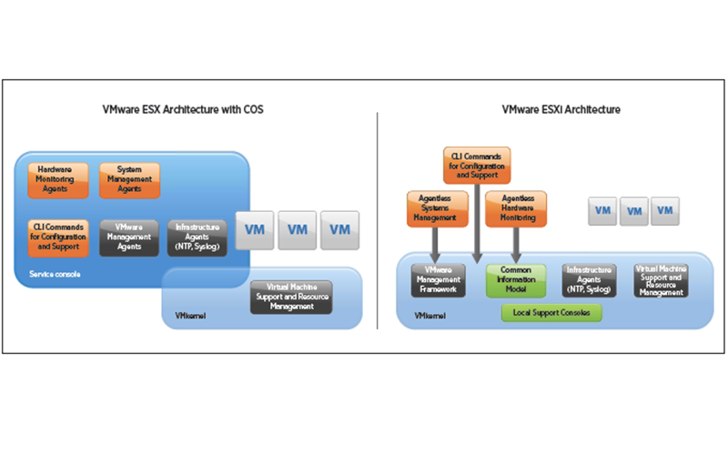

---
### VMware Hypervisor Size History
*[source image](https://www.virten.net/2023/01/vmware-esxi-3-5-8-0-hypervisor-size-comparison/)*
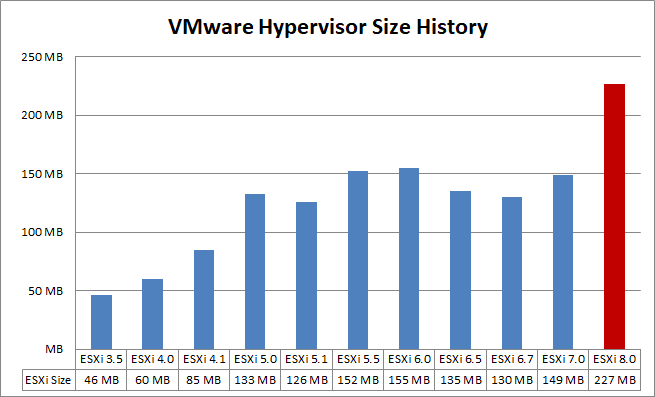

---

## Installation et configuration de ESXi

- Téléchargez l'image ISO de ESXi depuis le site de VMware (*à l'époque il y avait une version gratuite, Single Host ESXi , qui a été retirée par Broadcom. Aujourd'hui il vous faut des licences payantes.*)
- Créez une clé USB bootable avec l'image ISO. (*En utilisant [Rufus](https://rufus.ie/fr/) par exemple*)
 d'installation.

---

## Installation et configuration de ESXi

Commencez par plug votre clef USB, démarrez la machine et enfin , bootez sur la clef (ESXi-7.votre-version) en appuyant sur “Enter”.

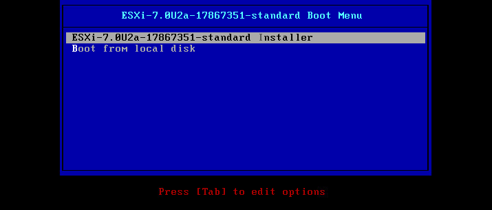

---

Chargement de l’installeur ESXi
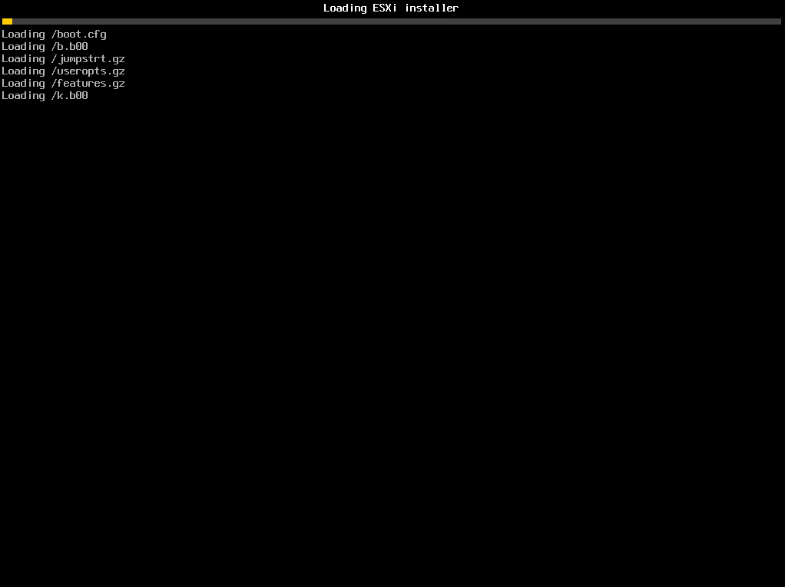

---

Chargement des modules et démarrage des services nécessaire à l’installation
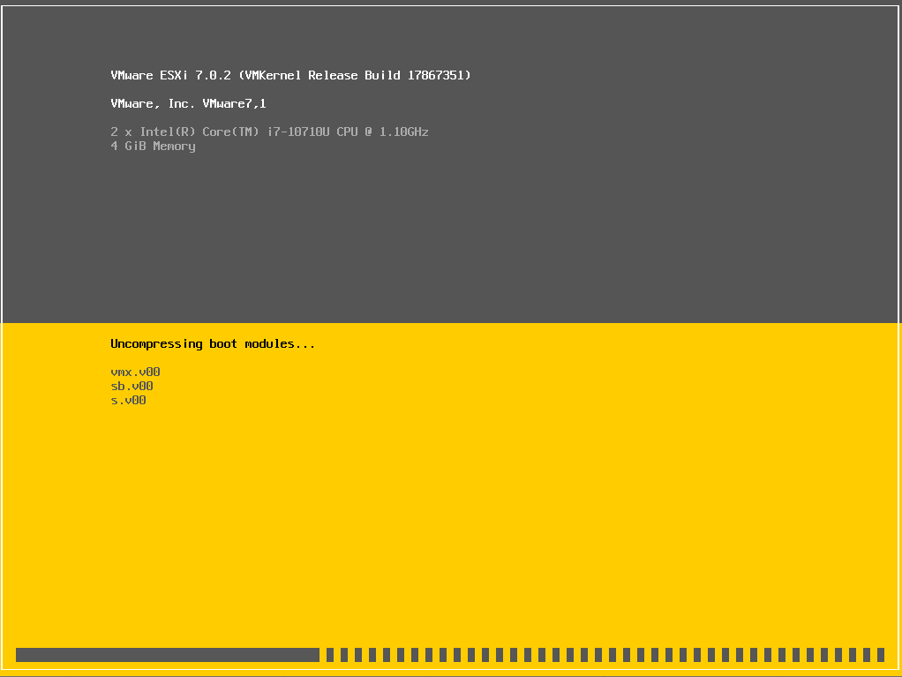

---

Choisir “Continue” en appuyant sur “Enter”
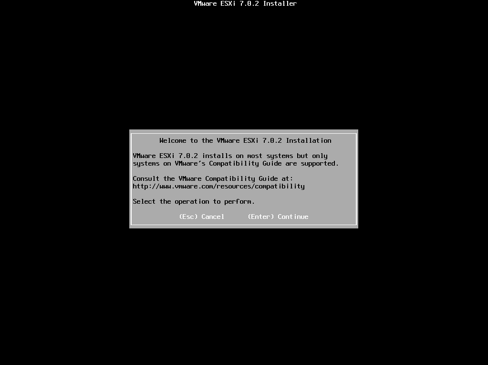

---

Accepter le license agreement en appuyant sur F11 (à lire en entier 😜)
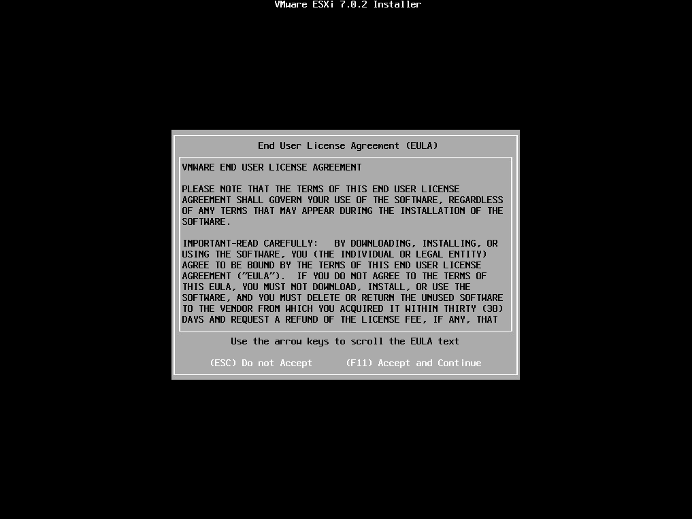

---

Choisir sur quel disque l’installer :
*Comme vous pouvez le voir, le disque proposé chez moi est un VMware, j’ai refait exprès l’installation pour les screenshots. Mais en somme j’installe ESXi sur un Intel NUC, sauf que c’est une ESXi’nception. ESXi installé sur une VM qui tourne sur ESXi installé sur le NUC. Vous suivez ?*
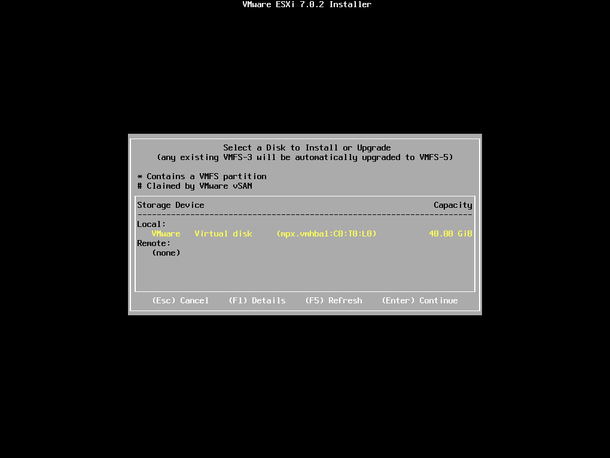

---

Ensuite il faut sélectionner le clavier et appuyer sur Enter :

---

Choisir un root password (il sera aussi utilisé sur l’interface web) :
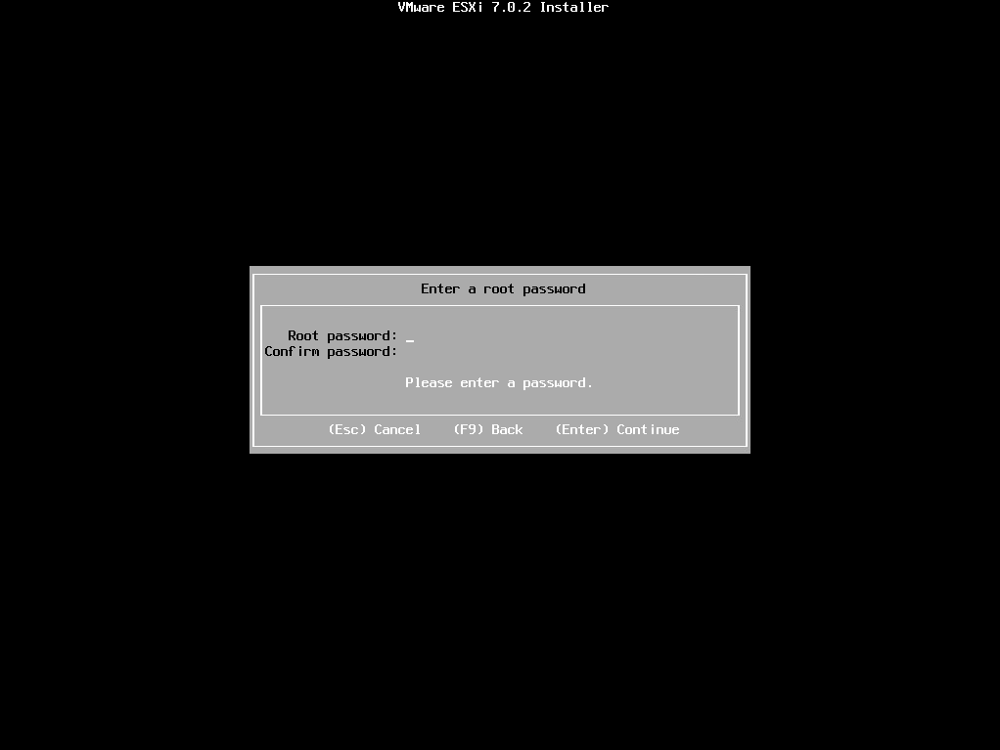

---
F11 pour installer
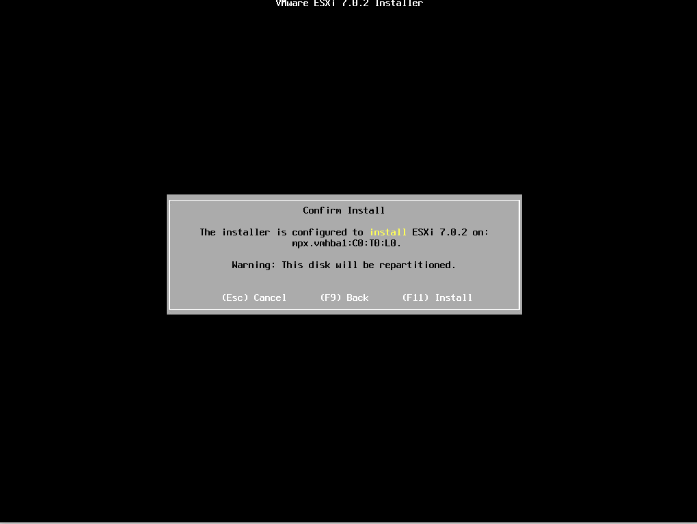

---
Install in progress... 
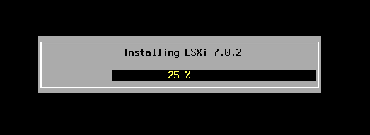

---
Reboot avec Enter
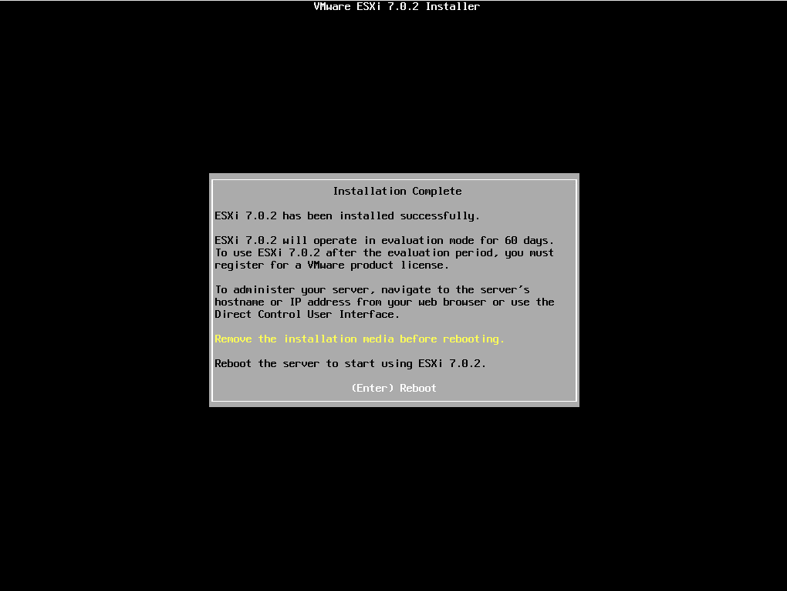

---

L’installation est terminée, vous pouvez accéder à la partie web en tapant votre ip dans un navigateur ou accéder aux settings en appuyant sur F2. Pour accéder aux settings il vous faudra entrer vos identifiants root. Les settings permettent par exemple de gérer la partie réseau en changeant votre IP ou VLAN , etc…
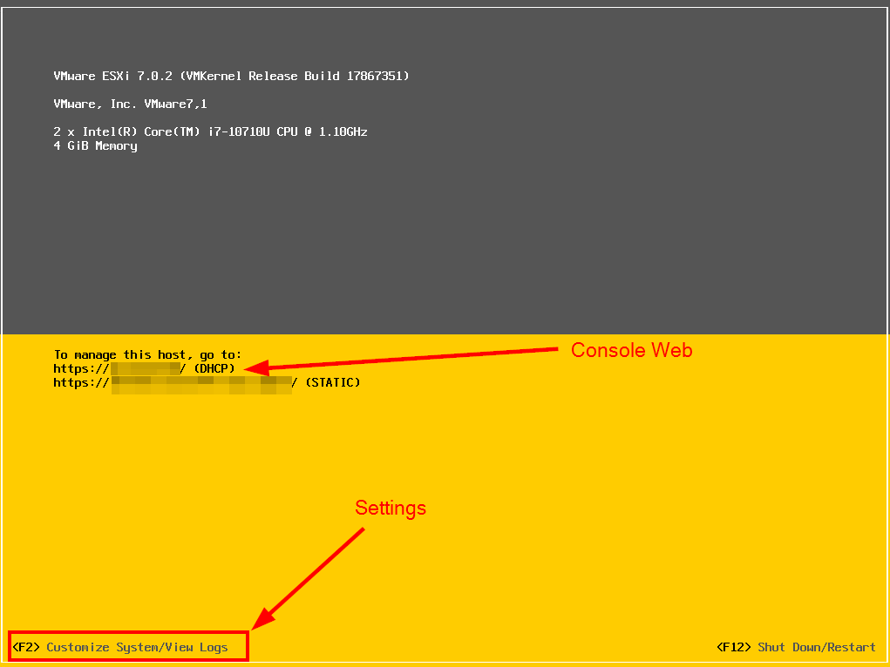

---
La console web ressemble à cela. 
Tapez vos identifiants “root” pour vous connecter.
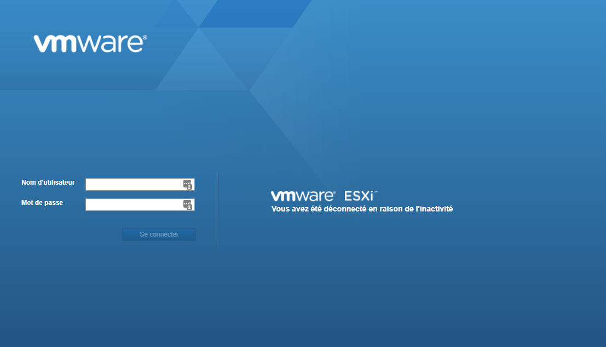

---
La console web de ESXi ressemble à cela :
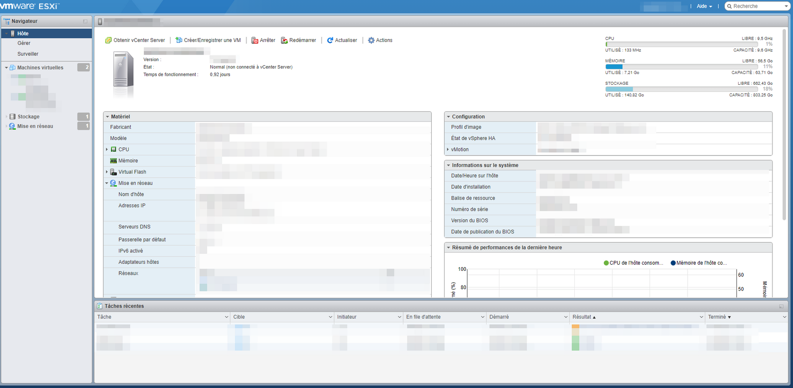

---

## vCenter & vSphere, c'est quoi ? 

**En résumé :**

- vSphere est la plateforme de virtualisation de VMware.
- vCenter et ESXi sont des composants de cette plateforme.

---

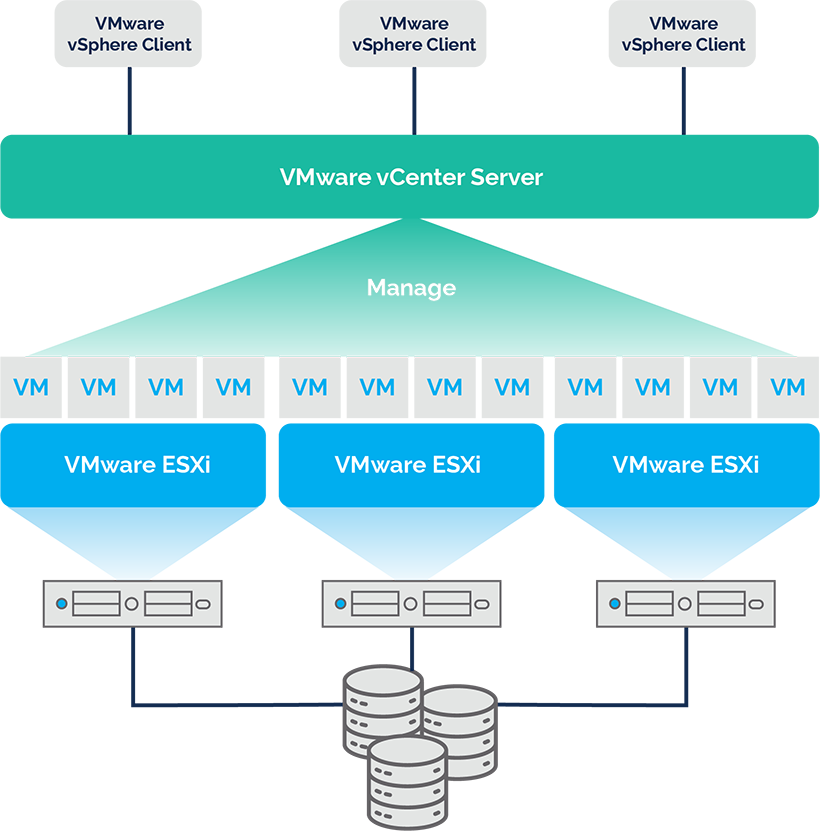   

*[source image](https://www.parkplacetechnologies.com/blog/vmware-vsphere-vs-vcenter-vs-esxi/)*

---

## vCenter Server

vCenter Server peut être installé sur Windows Server ou en utilisant vCenter Server Appliance (VCSA), une version Linux préconfigurée fonctionnant comme une VM sur ESXi. Il est nécessaire pour des fonctionnalités avancées comme vMotion, HA, DRS, et plus encore.
**Depuis quelques versions, VCSA a atteint la parité fonctionnelle avec sa version Windows et est désormais la méthode de déploiement préférée pour vCenter Server.**

---

## vCenter Server (suite)

vCenter Server Appliance (VCSA) est une machine virtuelle préconfigurée optimisée pour exécuter vCenter Server et ses composants. Vous pouvez déployer VCSA sur des hôtes ESXi ou sur des instances de vCenter Server. *[source image](https://geek-university.com/what-is-vcenter-server/)*

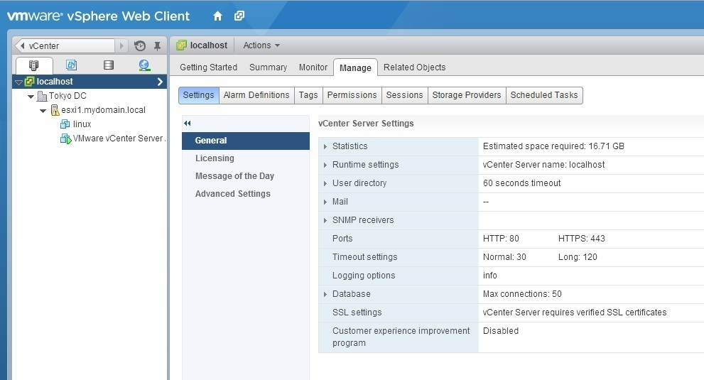

---

### Composants d'une instance vCenter Server

- **vSphere Client** : Interface graphique Web avec outils de gestion de vCenter Server.
- **Base de données vCenter Server** : stocke les éléments d'inventaire, les rôles de sécurité, etc.
- **vCenter Single Sign-On (SSO)** : authentification contre plusieurs référentiels d'utilisateurs.
- **Managed Host** : hôtes ESXi et leurs machines virtuelles respectives.

---

## vSphere

- **vSphere** est la suite de virtualisation de VMware qui inclut ESXi et vCenter. 

- **vSphere Client** est l'interface graphique de gestion de vCenter et des hôtes ESXi. Il permet de créer, configurer et gérer les machines virtuelles, les réseaux, et les ressources de stockage.

> Au slide suivant vous verrez une image de l'interface web nommée vSphere Client. *[source image next slide](https://blogs.vmware.com/vsphere/2016/12/new-vcenter-management-clients-vsphere-6-5.html)*

---

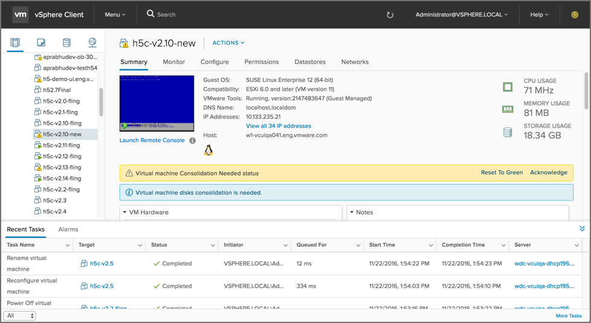

---

# Exercice "Fonctionnalités vSphere" par groupes | Présentations
- Grp1: vMotion, storage vMotion, AutoDeploy
- Grp2::  HA, DRS, Enhanced DRS, Persistent Memory
- Grp3: Fault Tolerance (FT), Thin Provisioning, Virtual Volumes, Instant Clone
- Grp4: Power Management, Proactive HA, Hot Plug
- Grp5: VM encryption,  vSAN, Authentification, Trust Authority 

> 30 min. recherches et préparation support ppt
> 10 min. présentation par groupe

---

## Fonctionnalités avancées de VMware

### vMotion et Storage vMotion
vMotion permet de migrer des machines virtuelles en cours d'exécution d'un hôte ESXi à un autre sans interruption de service. Storage vMotion permet de migrer les fichiers de disque virtuel d'un datastore à un autre.

### High Availability (HA)
HA redémarre automatiquement les machines virtuelles sur un autre hôte en cas de défaillance de l'hôte.

---

## Fonctionnalités avancées de VMware (suite)

### Distributed Resource Scheduler (DRS)
DRS équilibre automatiquement la charge de travail entre les hôtes ESXi en fonction des ressources disponibles.

### Fault Tolerance (FT)
FT fournit une redondance continue pour les machines virtuelles critiques en créant une copie en temps réel sur un autre hôte.

### Thin Provisioning
Thin Provisioning permet une allocation dynamique de la capacité de stockage, optimisant ainsi l'utilisation des ressources de stockage.

---

## Sécurité dans VMware

### Meilleures pratiques de sécurité
- Utiliser des mots de passe forts et des politiques de rotation des mots de passe.
- Restreindre l'accès aux interfaces de gestion.
- Activer les journaux d'audit pour surveiller les activités.

### Gestion des utilisateurs et des permissions
- Créer des rôles et des permissions personnalisés pour les utilisateurs.
- Utiliser l'authentification à deux facteurs pour renforcer la sécurité.

### Sécurisation des machines virtuelles et des hôtes
- Appliquer les mises à jour de sécurité régulièrement.
- Utiliser des pare-feu et des réseaux isolés pour protéger les machines virtuelles.

---

## Exercice pratique

### Introduction à l'exercice E02
L'exercice E02 vous permettra de tester vos connaissances sur VMware ESXi, vCenter, et vSphere. Vous répondrez à des questions ouvertes et à choix multiples, et classerez les fonctionnalités selon leur catégorie.

### Instructions pour compléter l'exercice
1. Lisez attentivement chaque question et répondez dans les espaces fournis.
2. Pour les questions à choix multiples, cochez la case correcte `[x]`.
3. Pour les questions de classement, indiquez "X" dans la colonne appropriée.
4. Remettez votre copie une fois terminée.

---

<!-- header: "C190 - VMWare > Sources" -->
# Sources

## Web
- https://people.epfl.ch/edouard.bugnion
- https://alexin.tech/fr/2024/02/12/ce-quil-faut-savoir-sur-le-rachat-de-vmware-par-broadcom-et-les-annonces-de-decembre-2023-et-janvier-2024/
- http://vgyan.in/what-is-the-difference-between-vmware-esx-and-vmware-esxi/

## Images 
- http://vgyan.in/what-is-the-difference-between-vmware-esx-and-vmware-esxi/
- https://www.virten.net/2023/01/vmware-esxi-3-5-8-0-hypervisor-size-comparison/

--- 

# Sources

## Web
- https://geek-university.com/what-is-vcenter-server/

## Images 
- https://www.parkplacetechnologies.com/blog/vmware-vsphere-vs-vcenter-vs-esxi/
- https://geek-university.com/what-is-vcenter-server/
